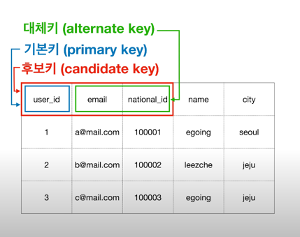

# 관계형 데이터 모델링

> 현실의 문제를 컴퓨터를 통해 담아내는 과정

- 업무파악 -> 개념적 데이터 모델링 -> 논리적 데이터 모델링 -> 물리적 데이터 모델링

## 업무파악

제대로 된 업무파악 없이 모델링을 잘할 수 없다.

- [기획서](https://ovenapp.io/view/EuTjedDvHdhBQLoxthGrqvBlGp1jBJj6/XDCP1)

## 개념적 데이터 모델링(Entity Relationship Diagram)

파악한 업무에서 개념을 뽑아내는 작업을 말한다.

- 개념적 모델링을 잘하기 위해서는 논/물리적 데이터 모델링과 업무파악을 잘해야 한다.
- 개념적 데이터 모델링은 개념에 집중하고 데이터베이스 패러다임과 거리를 둔다.
    - Entity -> Table
    - Attribute -> Column
    - Relation -> PK, FK
    - Tuple -> Row

> 데이터 모델링을 진행할 때 쓰기 화면을 확인하면 엔티티를 추출하기 용이하다.

### 식별자(Identifier)

원하는 대상을 지정하는 방법

- 식별자를 제외한 대상은 같은 값을 가지면 안 된다.
- PK(기본키)는 행을 식별하는 유일한 식별자다.
  

    - 후보키(candidate key)는 식별자가 될 수 있는 대상들이다.
    - 중복키

### 관계(Relationship)

관계는 PK(기본키)와 FK(외래키)가 연결됨으로써 구현된다.

### Cardinality, Optionality

- 1:1(일대일) one-to-one
- 1:N(일대다) one-to-many
- M:M(다대다) many-to-many

## 논리적 데이터 모델링

> 개념적 데이터 모델링(선행작업)이 잘 되어있다면 논리적 데이터 모델링을 수월하게 할 수 있다.

관계형 데이터베이스 환경에 맞게 데이터 형식을 정리하는 작업을 의미한다.

### Mapping Rule

- Entity -> Table
- Attribute -> Column
- Relation -> PK, FK

FK(외래키)가 없는 테이블을 먼저 작성한다.

> TypeORM: nullable 옵션의 기본값 false

### 관계의 처리

> 누가 외래키를 가지고 있는것이 맞을까? 부모/자식의 관계로 의존관계를 생각하면 쉽다.
