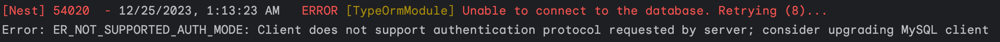

# 데이터베이스 연습장

관계형 데이터베이스의 꽃 `JOIN`을 연습한다.

- 모든 테이블은 하나의 역할을 가져야 한다.
- [생활코딩: SQL JOIN](https://opentutorials.org/course/3884): 해당 강의를 환경구성한다.

## 문제

### 공식문서를 읽고 차이를 이해하자

docker-compose로 환경을 구성하던 중 이해가 가지 않는 에러가 발생했다.



```text
[Nest] 54020  - 12/25/2023, 1:13:23 AM   ERROR [TypeOrmModule] Unable to connect to the database. Retrying (8)...
Error: ER_NOT_SUPPORTED_AUTH_MODE: Client does not support authentication protocol requested by server; consider upgrading MySQL client
```

난생처음 마주하는 에러에 조금 당황했지만 다행히도 금방 해결됐다.

- 원인: `mysql`, `mysql2`의 차이를 인지하지 못하고 발생한 부주의
- 해결과정
    - `docker-compose.yaml`은 문제가 없는 것으로 확인됐다. 문제는 TypeORM 설정이다.
    - 공식문서를 다시 확인했다. [TypeORM 공식문서](https://typeorm.io/)에서 힌트를 얻었다.
    - [NestJs 공식문서](https://docs.nestjs.com/techniques/database)에서도 `mysql2`를 사용하고 있었다.

```shell
# bad
# npm install --save @nestjs/typeorm typeorm mysql

# good
npm install --save @nestjs/typeorm typeorm mysql2
```

Node.js 환경에서 MySQL 데이터베이스와 상호작용 위한 두 개의 다른 패키지가 있다.
두 패키지는 대표적으로 비동기 함수 처리의 큰 차이를 보인다.

- 프로미스(Promise) 지원여부
    - [mysql](https://www.npmjs.com/package/mysql): 콜백형식
    - [mysql2](https://www.npmjs.com/package/mysql2): Promise 지원

MySQL 8.0과의 호환을 위해 `mysql2` 패키지를 설치하니 문제가 바로 해결됐다.