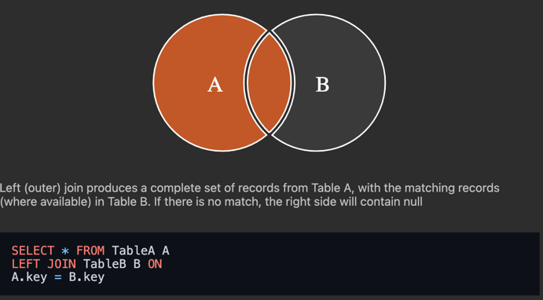
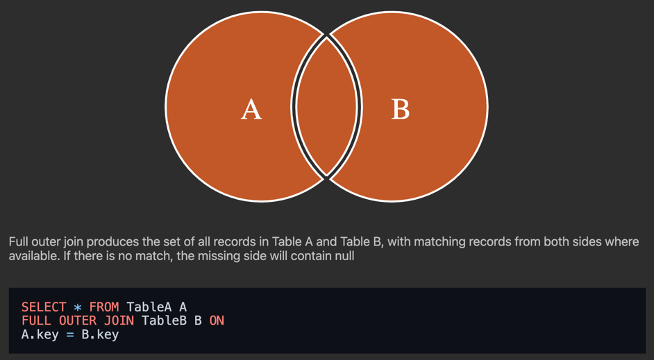

# JOIN

`JOIN`은 두 개 이상의 테이블 사이의 관련 열(column)을 기반으로 두 개 이상의 테이블에서 행(row)을 결합하는 데 사용된다.

### 목표

- 여러 JOIN 방법을 상황에 맞게 선택하여 사용한다.
- `INNER JOIN`과 `LEFT JOIN`을 중점으로 학습한다.

## INNER JOIN


```text
SELECT column_name(s)
FROM table1
INNER JOIN table2
ON table1.column_name = table2.column_name
```

> INNER JOIN으로 풀 수 없는 문제는 다른 JOIN으로 해결한다.

- 두 테이블 모두에서 일치하는 값이 있는 레코드를 반환한다.
- 엄격하다.

## LEFT JOIN



- 기준이 되는 테이블을 왼쪽에 두고, 이 표를 기준으로 오른쪽 테이블을 합성해서 하나의 테이블로 만드는 방법이다.

```text
SELECT * FROM [테이블] LEFT JOIN [연결 테이블] ON [조건]
```

- 가장 인기있는 JOIN 방법이다.
    - 데이터를 출력할 때 양쪽 모두에 있는 정보를 출력하기보단 한 쪽에 있는 데이터를 출력하는 경우가 많다.
- 연결되지 않는 데이터는 NULL로 처리한다.
- 테이블이 여러개도 가능하다.

## FULL OUTER JOIN



```text
SELECT column_name(s)
FROM table1
FULL OUTER JOIN table2
ON table1.column_name = table2.column_name
WHERE condition;
```

- table1 또는 table2 테이블 레코드에 일치하는 항목이 있는 경우 모든 레코드를 반환한다.(합집합)

> FULL OUTER JOIN 구문을 지원하지 않는 경우 (LEFT JOIN 결과) UNION (RIGHT JOIN 결과)로 조합한다.
> 가볍게 넘어간다.